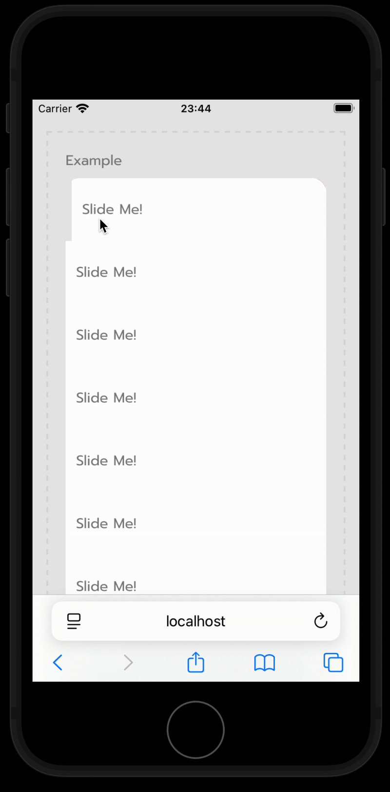

# Slide To Action

A simple slide to action React component.



## Installation

```bash
yarn add slide-to-action
# or with npm
npm install slide-to-action
```

## Usage

```jsx
import { SlideToAction } from 'slide-to-action';

const Save = () => <div>Save</div>;
const Delete = () => <div>Delete</div>;

const App = () => {
  return (
    <SlideToAction Content={<div>hello world</div>} actions={[Save, Delete]} />
  );
};
```

## Props

| Name         | Type            | Default           | Description                                     |
| ------------ | --------------- | ----------------- | ----------------------------------------------- |
| Content      | React.ReactNode | None              | The content to be displayed.                    |
| actions      | Action[]        | None              | The actions to be displayed.                    |
| actionsWidth | number          | 0.35              | The width of the actions.                       |
| openFrom     | 'Left'          | 'Right' \| 'Left' | The direction from which the actions will open. |

## Action Props

| Name     | Type       | Default | Description                         |
| -------- | ---------- | ------- | ----------------------------------- |
| index    | number     | None    | The index of the action.            |
| progress | number     | None    | The progress of the action. (0-1.5) |
| close    | () => void | None    | A function to close the action.     |

## TODO

- [ ] Add tests
- [ ] Add more examples
- [ ] Remove `actions` & `openFrom` props and use `actionsRight` and `actionsLeft` instead
- [ ] Add apply first action on swipe right/left
- [ ] Provide actions components with utilities to handle animation
